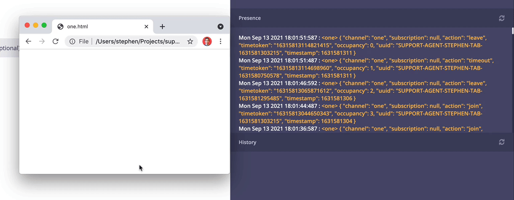

# Support Agent Presence Tracking

Two options are demonstrated.
`one.html` and `two.html`.
The example code shows the SDK settings needed to accomlish each option.

## Presence Tuning/Configuration for Support Agent Tracking

> **tl;dr**
> **Option one is a best practice approach.**

### Option One

> This option also is a good fit for TCP-FIN tracking.
> When a TCP connection is closed, this can be counted as a presence `leave` event.
> The example also offers a
> `window.addEventListener('beforeunload', event => { pubnub.unsubscribeAll(); } );`
> browser event.
> Both options work in practice.

An "agent-channel" is a channel the agent subscribes to.
Each tab has an "agent-uuid" with a suffix of a "windowID/tabID".
The webhook is registered to "active" and "inactive".
When the agent opens their first tab, the "active" webhook fires.
Subsequent tabs being opened will not fire any events.
Once all tabs are closed, the "inactive" webhook fires.
The occupancy count represents the number of Tabs open for that agent's channel.
No special settings are needed, though we can tune/tweak behavior as needed.
This option has the most value and is more inline with stock presence capability.
This is a good design pattern that can be used to
accomplish the support chat agent business requirements.

### Option Two

Using special JS SDK settings and special PubNub Config settings,
we can track an Agent's activity across all tabs, using a single UUID.
After inactivity of 300 seconds (tunable),
a timeout event is fired, marking the agent has gone offline.
This option is the simplest,
though requires specific SDK and PubNub Config settings.
It's the simplest as it requires little consideration.
